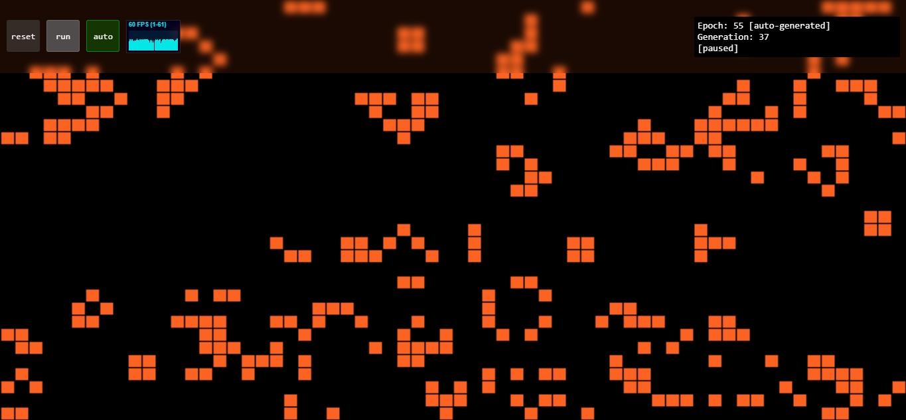

## wasm-game-of-life

### to run locally

0. Install [wasm-pack](https://rustwasm.github.io/wasm-pack/)
1. `npm install`
2. `npm run runall`

if you get `"error:0308010C:digital envelope routines::unsupported"` you need to run the following 
- on windows
`set NODE_OPTIONS=--openssl-legacy-provider`

- on *nix `export NODE_OPTIONS=--openssl-legacy-provider`